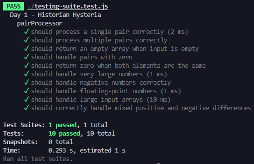

# adventofcode2024

Link to public challenge: [Advent of Code](https://adventofcode.com/2024/)

**Day 1:**

_Challenge_

Advent of Code 2024 begins with "Day 1: Historian Hysteria," where the Chief Historian, vital to the Christmas sleigh launch, has mysteriously disappeared. Senior Historians believe he was visiting historically significant locations near the North Pole and have enlisted your help in searching for him. To save Christmas, you need to help them collect fifty stars, earned by solving puzzles, before Santa sets off on 25th December. However, the search starts with a problem—two incomplete lists of location IDs are found in the Chief Historian’s office, and these need to be reconciled to identify the places to check.

The puzzle requires pairing and comparing numbers from the two lists to calculate the total distance between them. For each pair, the smallest remaining numbers from both lists are matched, and their difference is calculated. The objective is to sum these differences to determine the total distance. Using the example provided, the distances add up to 11. Participants must perform a similar calculation on their actual puzzle input to assist the Senior Historians in locating the Chief Historian and ensuring Christmas is saved.

_Comments_

Wow. And I mean wow. This was so much fun. My first thought was obviously how I was going to be able to parse the input information given to a readable file, and the fs library helped LOADS. .

Some of the tests I wrote felt a bit redundant as I went on, name as the data set given for the task was admittedly huge, but I'm glad that the functions written do work as I intended.
